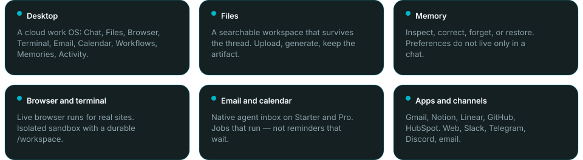

<!-- Construct Computer -->

  
  

    
    &nbsp;
    
    &nbsp;
    
    &nbsp;
    
    &nbsp;
    
  

  

    Chat windows reason for a minute, then forget you exist. Construct gives an AI coworker a real cloud desktop — browser, terminal, files, email, calendar, memory that survives the session — and leaves it running after you close the laptop.
  

  

    Open the screen from any device. Watch it work. Take the keys back. Or don't. It lives on the cloud, not on your machine.
  

  

    
  

  

    We built this because hiring was the obvious answer and the runway math said no. The last tool hit 30k users and got acquired. Engineering was fine. Being the CRM, the support inbox, and the follow-up guy at the same time was not.
  

  

    <a href="https://construct.computer/about/">About</a>
    ·
    <a href="https://construct.computer/use-cases/">Use cases</a>
    ·
    <a href="https://construct.computer/blog/running-ai-agents-on-cloudflare-not-vms/">How it runs</a>
    ·
    <a href="https://www.producthunt.com/products/construct-computer">Product Hunt</a>
  

  

    
  

  <h2>The desk</h2>
  

    Every agent gets its own cloud desktop on day one. Files and memory stick around after the chat dies. Live browser and shell don't. You can interrupt a turn, correct memory, and read a bounded Activity log of what actually happened.
  

  

    
  

  

    Once a run is right, freeze it into a workflow or an internal app. Next time it follows defined logic instead of rolling the dice again. Hosting and access are handled, so what one person builds, the team can run.
  

  

    The harness is ours, on Cloudflare's edge — not a VM per agent. Idle doesn't burn compute. That's why leaving a dozen of them running overnight is a plan, not a billing incident.
  

  

    
  

  <h2>Founders</h2>
  <table>
    <tr>
      <td align="center" width="50%" valign="top">
        
         
        <strong>Ankush Singh</strong>
         
        Co-founder &amp; CEO
          
        <a href="https://x.com/ankushKun_">X</a>
        ·
        <a href="https://linkedin.com/in/ankushKun">LinkedIn</a>
        ·
        <a href="https://construct.computer/authors/ankush/">Profile</a>
      </td>
      <td align="center" width="50%" valign="top">
        
         
        <strong>Nischal Naik</strong>
         
        Co-founder · harness &amp; product
          
        <a href="https://x.com/naik_nischal">X</a>
        ·
        <a href="https://linkedin.com/in/nischal-naik-a188b0288">LinkedIn</a>
        ·
        <a href="https://construct.computer/authors/nischal/">Profile</a>
      </td>
    </tr>
  </table>
  <blockquote>
    

      I tried every agent I could find. Every one reasoned for a minute to do a ten-second task, burned tokens like they were free, and I spent more time fixing its work than doing my own. The models were ready. Nothing around them was. So we built the coworker we actually wanted.
    

    
— Ankush

  </blockquote>
  

    Nischal came from isolates and WASM — decentralised hosting and compute — which is most of how Construct runs under the hood. Being small means we get to make the weird calls.
  

  

    
  

  <h2>Come hang</h2>
  

    <a href="mailto:hello@construct.computer">hello@construct.computer</a>
    ·
    <a href="https://discord.gg/puArEQHYN9">Discord</a>
    ·
    <a href="https://cal.com/construct/15min">15 min demo</a>
    ·
    <a href="mailto:security@construct.computer">security</a>
    ·
    <a href="mailto:careers@construct.computer">careers</a>
  

  

    Marketing site is public in <a href="https://github.com/hypervoid-inc/construct">construct</a>. The OS is proprietary. Cheers.
  

